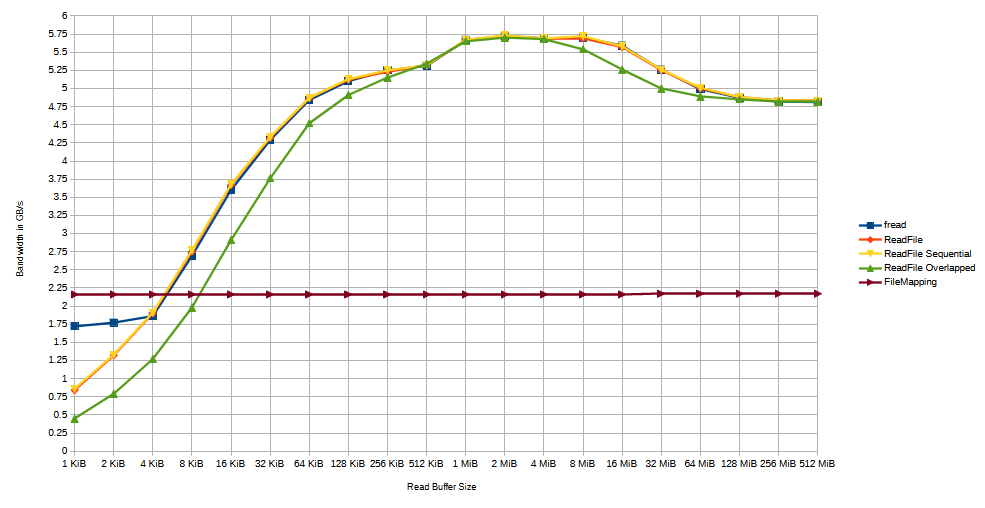

# C File Reading Benchmark

This benchmark is comparing the runtime of various C file reading methods for Windows.

## Info

Build Platform: `Windows 11 Home 64-bit - 23H2 - 22631.4169`

Compiler: `Microsoft (R) C/C++ Optimizing Compiler Version 19.38.33135 for x64`

## How to build

Make sure you have `cl.exe` installed and it can be used from the terminal (run `cl /help` to test).
To obtain the latest version of the MSVC compiler check out [PortableBuildTools](https://github.com/Data-Oriented-House/PortableBuildTools).

Go to the main directory of the source code and run `build` to execute the `build.bat` script. This will build the product in debug mode. The resulting build artefacts can be found under `build\debug`. To build the product in release mode run `build release` instead. The resulting build artefacts can be found under `build\release`.

To run the built executable right after the build step use `build run` (`build debug run` or `build release run` if you want to target specific versions. The default is `debug`).

To run the built executable with the [RAD Debugger](https://github.com/EpicGamesExt/raddebugger) attached use `build rundbg` (`build debug rundbg` or `build release rundbg` if you want to target specific versions. The default is `debug`).

To create an executable that is ready for distribution use `build release publish`. The resulting build artefacts can be found under `build\publish`.

## My Results

I have run this benchmark on my personal development machine on a `12.85 GiB` large text file. My machine has the following configuration:

* AMD Ryzen 7 7700 8-Core Processor @ 3.8GHz (5.35GHz Boost)
* ASRock Mainboard B650M Pro RS WiFi
* Corsair 32 GB (Dual-Channel 2x 16 GB) @ 2.39GHz
* Samsung SSD 980 PRO 2TB NVMe (PCIe x4 16.0 GT/s @ x4 16.0 GT/s)

And these are the results for all the different buffer sizes:

Some notes on the results:

* Overlapped performance is not ideal in this benchmark because the processing of the read data is negligible. It will probably help out a lot more in situations where a lot of processing is done on the data after reading a chunk.
* The benchmarks had a warmup run which means all results are based on a cached file and not a cold run. I might update this to also include cold run results in future.
* FileMapping generates a lot of page faults which can not be prevented (at least to my knowledge) and it also does not account for buffer allocations.
* fread being better on low buffer sizes until around `4KiB` is due to the internal `4KiB` buffer used for reads.

## License

Unless stated otherwise in individual source files the license is `Public Domain (www.unlicense.org)`
